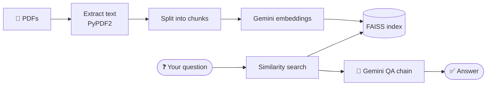

<div align="center">

# 📄 Chat with PDFs (Gemini + FAISS)

**Upload one or more PDFs and ask questions about them - answers come from a retrieval-augmented Gemini pipeline.**


</div>

---

## ✨ How it works



1. Upload PDFs in the sidebar and press **Proceed** to build a local FAISS index.
2. Ask a question; the most relevant chunks are retrieved and passed to Gemini with a prompt.
3. The reply is shown in the page.

## 🚀 Getting Started

### Prerequisites

- Python 3.9+
- A [Google AI Studio API key](https://aistudio.google.com/app/apikey)

### Install & run

```bash
git clone https://github.com/Arashomranpour/pdf_llm.git
cd pdf_llm
pip install streamlit PyPDF2 langchain langchain-google-genai google-generativeai faiss-cpu
```

The script `app (2).py` currently contains the API key inline. Replace it with your own key (preferably read it from an environment variable such as `GOOGLE_API_KEY`) before running:

```bash
streamlit run "app (2).py"
```

## 📁 Project Structure

```
.
├── app (2).py    # Streamlit app: PDF parsing, embeddings, FAISS, QA chain
└── README.md
```

## 🛠️ Tech Stack

`Streamlit` · `LangChain` · `Google Gemini` · `FAISS` · `PyPDF2`
